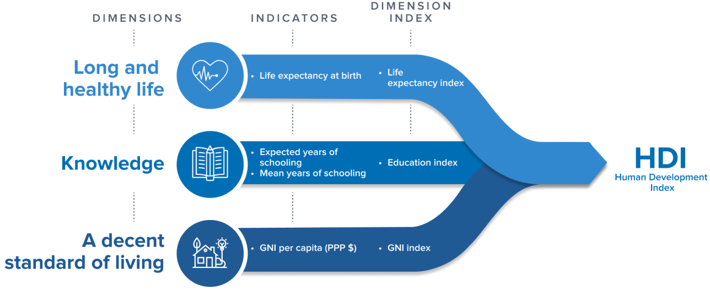
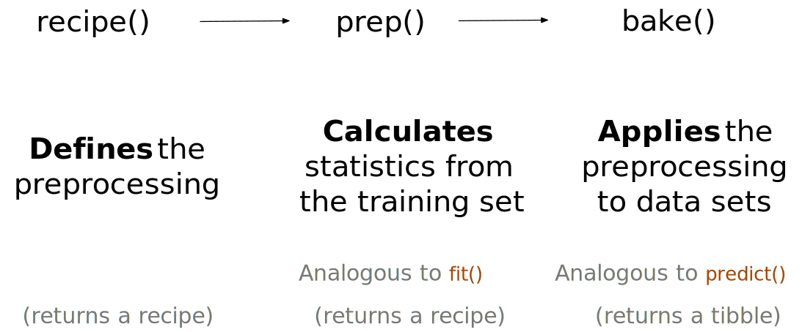

```{r setup, include=FALSE}
knitr::opts_chunk$set(echo = TRUE)
```

```{r message=FALSE, warning=FALSE, include=FALSE, paged.print=FALSE}
knitr::opts_chunk$set(echo=TRUE, message=FALSE, warning=FALSE, collapse=TRUE, highlight=TRUE, paged.print=FALSE, prompt=TRUE, strip.white=FALSE, tidy = TRUE)
```

---

Este texto se basa (parcialmente) en los siguientes materiales:

- Capítulo 12 del libro [Introduction to Statistical Learning](https://www.statlearning.com/)
- Capítulo 16 del libro [Tidy modeling with R](https://www.tmwr.org/dimensionality.html)

---

```{r}
library(patchwork)
library(tidyverse)
library(tidymodels)
```
## Objetivos
- Comprender los fundamentos conceptuales del análisis no supervisado en general y del análisis de compoentes principales en particular
- Aprender a implementar PCA en R, en el marco del `tidyverse`

## Introducción
Supongamos la siguiente situación: tenemos un dataset con varias variables referidas a la condición de vida de la población. Queremos lograr dos objetivos:

- representar la información contenida en estas variables en una menor cantidad de variables
- construir un solo índice que resuma la información

Ambos objetivos forman parte de un tipo de problema típico del aprendizaje automático llamado reducción de dimensionalidad. Vamos a ver una de las técnicas  para atacar este tipo de problema que es particularmente útil si se cumplen al menos tres condiciones:

- todas la variables a combinar son cuantitativas
- hay cierto grado de correlación entre las mismas
- no hay demasiados ceros o valores vacíos

La técnica se llama Análisis de Componentes Principales o PCA (por sus siglas en inglés). Cuando nos enfrentamos a un gran conjunto de variables correlacionadas, PCA nos va a permitir "resumir" esas variables en un conjunto menor que permitan explicar la mayor parte de variablidad (información) en esas variables originales. Se trata de un enfoque no supervisado dado que solo va a utilizar un conjunto de variables independientes ($X_{1}, X_{2}, ..., X_{p}$) sin ninguna variable de respuesta asociada. Además de producir variables derivadas para su uso en el aprendizaje supervisado, PCA también sirve como una herramienta para la visualización de datos (visualización de las observaciones o visualización de las variables). También se puede utilizar como un herramienta para la imputación de datos, es decir, para completar los valores faltantes en un matriz.


## Planteo del problema
Supongamos que deseamos visualizar $n$ observaciones con una serie de $p$ variables medidas en $X1, X2,...,Xp$, como parte de un análisis exploratorio de datos. Podríamos intentar examinando diagramas de dispersión bidimensionales de los datos, cada uno de los cuales contiene las mediciones de $n$ observaciones en dos de los características. Sin embargo, hay $\binom{p}{2} = \frac{p(p-1)}{2}$ gráficos posibles. Por ejemplo, si hubiera 10 variables (un número nada elevado) tendríamos 45 gráficos para analizar. Si $p$ es grande, entonces ciertamente no será posible mirarlos todos; además, lo más probable es que ninguno de ellos ser informativo ya que cada uno contiene solo una pequeña fracción del total información presente en el conjunto de datos. Claramente, se requiere un método mejor. En particular, nos gustaría encontrar una representación de baja dimensión de los datos que capture la mayor parte de la información como sea posible. Por ejemplo, si podemos obtener una representación de esas $p$ variables en dos dimensiones que capturen la mayor parte de la información, entonces podríamos generar un solo gráfico.

PCA proporciona una herramienta para hacer precisamente esto. Encuentra una representación de baja dimensión de un conjunto de datos que contiene la mayor cantidad posible de la información. El supuesto por detrás es que nuestras $n$ observaciones "viven" en un espacio de $p$ dimensiones. Pero la cuestion es que no todas esas dimensiones son igual de relevantes. Entonces, PCA intenta encontrar un conjunto menor a $p$ de dimensiones relevantes. En este caso, la idea de "relevancia" o "información" se define como la variabilidad de información que contienen. Cada una de las dimensiones encontradas por PCA es una combinación lineal de las características $p$. ¿Cómo se estiman esas nuevas dimensiones?

El primer componente principal (`PC1`) se define como la combinación lineal normalizada de las $p$ variables independientes 

$$
Z_{1} = \phi_{1,1} \times X_{1} + \phi_{2,1} \times X_{2} + ... +  \phi_{p1} \times X_{p}
$$

que tiene la mayor varianza. Al decir "normalizada" queremos decir que $\sum^p_{j=1}\phi_{j1}^2=1$. Todos los elementos $\phi_{11},...,\phi_{p1}$ son los llamados _loadings_ o "cargas" del primer componente. En conjunto conforman el vector de pesos o cargas del primer componente $\phi_{1} = (\phi_{11}, ..., \phi_{1p})^T$. 

Dado un dataset de $n \times p$, llamado $\textbf{X}$, ¿cómo calculamos el primer componente principal? Como solo estamos interesados en la varianza, suponemos que cada una de las variables en $\textbf{X}$ se han centrado para tener una media cero (es decir, las medias de la columna de $\textbf{X}$ son cero). Luego, buscamos la combinación lineal de los valores de características de muestra de la forma

$$  
z_{i1} = \phi_{11} \times x_{1} + \phi_{21} \times x_{2} + ... +  \phi_{p1} \times x_{p}
$$

que tenga la mayor varianza (con la restricción $\sum^p_{j=1}\phi_{j1}^2=1$). En otras palabras, el vector de cargas factoriales del primer componente resuelve el siguiente problema de optimización:

$$
\max_{\phi_{11}, ..., \phi_{p1}} = \left\{\frac{1}{n}\sum^n_{i=1} \bigg( \sum^p_{j=1} \phi_{j1}x_{ij} \bigg)^2 \right\} \textrm{sujeto a}  \sum^p_{j=1}\phi^2_{j1} =1
$$
De la ecuación previa, podemos reescrbir la anterior como $\frac{1}{n}\sum^n_{i=1}z_{i1}^2$. Dado que $\frac{1}{n}\sum^n_{i=1}x_{ij}=0$ (el promedio es cero porque se asume que las varibales están normalizadas), el promedio de $z_{11},...,z_{n1}$ también va a ser cero. Así, el problema de maximización anterior se convierte en un problema en el que lo se maximiza es la varianza muestral de los $n$ valores de $z_{i2}$. Este problema puede resolverse mediante una técnica llamada _eigen decomposition_, ampliamente utilizada en álgebra de matrices. No obstante, su desarrollo queda por fuera de los objetivos de este curso.

Hay una buena interpretación geométrica para el primer componente principal. El vector de carga $\phi_{1}$ con elementos $\phi_{11}, \phi_{21}, ..., \phi_{p1}$  define una dirección en espacio de características a lo largo del cual los datos varían más. Si proyectamos los $n$ datos $x_{1},...,x_{n}$ en esta dirección, los valores proyectados son las puntuaciones del componente principal $z_{11},...,z_{n1}$ en sí mismas.

El segundo componente principal $Z_{2}$ es una combinación lineal de las variables $X_1,...,X_p$ ´que explica la mayor cantidad de varianza de todas las combinaciones lineales posibles que están descorrelacionadas (son ortogonales, es decir perpendiculares) a $Z_{1}$.

$$
z_{i1} = \phi_{12} \times x_{1} + \phi_{22} \times x_{2} + ... +  \phi_{p2} \times x_{p}
$$

Una vez que hemos calculado los componentes principales, podemos graficarlos entre sí para producir vistas de baja dimensión de los datos. Por ejemplo, podemos graficar el vector de puntaje $Z_1$ contra $Z_2$, $Z_1$ contra $Z_3$ y así sucesivamente. Geométricamente, esto equivale a proyectar los datos originales en el subespacio dividido por $\phi_1$, $\phi_2$ y $\phi_3$ y trazado de los puntos proyectados.

## Un ejemplo: re-inventando el Índice de Desarrollo Humano
Vamos a ejemplificar este desarrollo teórico. El dataset `HDI_HDR2020_040722.csv` contiene las componentes del Human Development Index (HDI) elaborado por UNDP para el período 1992-2019. El HDI es un promedio a nivel país de cuatro variables fundamentales:



En el dataset se encuentran bajo los siguientes nombres:

- `le_2019`: expectativa de vida al nacer de la población
- `eys_2019`: años “esperados” de escolaridad de la población
- `mys_2019`: años promedios de escolaridad
- `gnipc_2019`: producto bruto interno per cápita
- `hdi_2019`: HDI para el país

En ambos datasets van a encontrar los códigos de país (`iso3c`) y las etiquetas de país (`country`) y algunas otras menos útiles.

Carguemos el dataset:

```{r}
idh <- read_csv('./data/HDI_HDR2020_040722.csv')
```

Primero, vamos a quedarnos soamente co las variables correspondientes al año 2019 de cada indicador:

```{r}
idh <- idh %>%
  select(iso3c: region, ends_with("_2019")) %>%
  drop_na()

head(idh)
```

De esta forma, nos queda un dataset de $n=147$ y $p=4$ para estimar nuestros componentes principales. Vamos a utilizar PCA para calcular un "índice alternativo" al IDH. Para eso, vamos a utilizar un paquete dentro del metapquete `tidymodels`, llamado `recipes` (receta). Una `recipe` es un objeto que define una serie de pasos para el procesamiento de datos. Una `recipe` define los pasos a través de las funciones `step_*()` sin ejecutarlas inmediatamente; es sólo una especificación de lo que debe hacerse:

```{r}
recipe_pca <- idh %>% 
                select(le_2019:gnipc_2019) %>%
                recipe(~.) %>%
                step_normalize(all_numeric()) %>%
                step_pca(all_numeric(), num_comp=2)

recipe_pca
```
Veamos qué pasó acá, paso por paso.

- Llamamos a `recipes()` con una fórmula que define los roles de los "ingredientes" o variables (por ejemplo, predictor, resultado). Solo usa los datos `idh` en  para determinar los tipos de datos para las columnas. En este caso (como estamos en aprendizaje no supervisado, todas son predictores).

- `step_normalize()` va normalizar todas las variables especificadas (en este caso, las cuatro componentes del IDH) para que tengan media igual a cero y desvío estándar igual a uno. Vamos a volver sobre este punto al final.
 
- `step_pca()` va a efectuar el análisis de componentes principales sobre esas mismas cuatro variables

Para especificar las variables nosotros las nombramos. Pero podríamos haber usado otras instrucciones. Por ejemplo , 

- `all_numeric()`, `all_integer()`, `all_double()`, `all_nominal()`, `all_ordered()`, `all_unordered()`, `all_factor()`, `all_string()`, `all_date()` y `all_datetime()` pueden usarse para seleccionar variables según su tipo.

- `all_predictors` o `all_outcomes` para seleccionar según su rol en el objeto `recipe()`

- También podrían usar algunos viejos conocidos: `starts_with()`, `ends_with()` de `dplyr`

Más detalles [acá](https://recipes.tidymodels.org/reference/has_role.html).

¿Cuál es la ventaja de usar una receta sobre una fórmula o predictores sin procesar? Hay algunos, incluyendo:

- Estos cálculos se pueden reciclar entre modelos, ya que no están estrechamente acoplados a la función de modelado.
- Una receta permite un conjunto más amplio de opciones de procesamiento de datos que las que pueden ofrecer las fórmulas.
- La sintaxis puede ser muy compacta. Por ejemplo, `all_nominal_predictors()` se puede usar para capturar muchas variables para tipos específicos de procesamiento, mientras que una fórmula requeriría que cada una se enumere explícitamente.
- Todo el procesamiento de datos se puede capturar en un solo objeto R en lugar de secuencias de comandos que se repiten o incluso se distribuyen en diferentes archivos.

Bueno, vamos a ejectuar el PCA de una vez:

```{r}
pca_estimates <-  prep(recipe_pca, training = idh)
pca_data <- bake(pca_estimates, idh)
```

Aquí hemos utilizado dos métodos importantes dentro del paquete `recipes`:

- `prep()`: estima el modelo (en este caso, la `recipe()` a los datos de entrenamiento
- `bake()`: aplica la  `recipe()` a un dataset



En el esquema anterior puede verse que `prep` es un análogo a los métodos de fiteo y `bake`, a los métodos `predict`.

Ahora bien, esto quiere decir que en `pca_estimates` tenemos toda la información que se genera como resultado de estimar el modelo PCA. En `pca_data` en cambio, vamos a tener las "predicciones" del modelo PCA, es decir, los componentesen cuestión. De hecho, si observan, `pca_estimates` es una lista y `pca_data` una tibble.

## Evaluación de PCA
### Cargas factoriales (factor loadings)
Vamos a proceder, entonces, a evaluar los resultados de nuestro modelo. Una primera forma de evaluarlo, tratar de interpretar las llamadas cargas o pesos factoriales (los habíamos llamado $\phi_{p,k}$ más arriba). Como vimos, el primer componente ($Z_{1}$) y el segundo ($Z_{2}$) son  combinaciones lineales de las features ($X_{p}$)

$$
z_{1} = \phi_{1,1} \times mys\_2019 + \phi_{2,1} \times ie\_2019 + \phi_{3,1} \times gnipc\_2019 + \phi_{4,1} \times eys\_2019 \\
z_{2} = \phi_{1,2} \times mys\_2019 + \phi_{2,2} \times ie\_2019 + \phi_{3,2} \times gnipc\_2019 + \phi_{4,2} \times eys\_2019
$$
De esta forma, cada peso factorial nos dice qué tan asociadas están las variables a cada uno de los factores:

```{r}
tidy(pca_estimates, 2, type="coef") %>%
  filter(component %in% c("PC1", "PC2")) %>%
  ggplot(aes(value, terms, fill=terms)) +
    geom_col(show.legend = FALSE) +
    geom_text(aes(label=round(value,2))) +
  labs(title="Cargas factoriales (comp. 1 y 2)",
           x="Valor",
           y="Variable") + 
    facet_wrap(~component, nrow=1) +
    theme_minimal()

```

Puede verse que el primer componente (`PC1`), entonces, tiene cargas bastante bien repartidas. Es un poco más baja en el producto per cápita^[De hecho, el `PC2` aparece represetantdo casi exclusivamente al producto.]. Pero en todos los casos, `PC1` muestra signo positivo con las cuatro variables. Es decir que cuando `PC1` aumenta, también aumentan las cuatro variables componentes y, por ende, tendrán un mayor "desarrollo humano".


### Proporción de varianza explicada
Ahora podemos hacer una pregunta que es casi natural: ¿cuánta de la información en un conjunto de datos dado se pierde al proyectar las observaciones en los primeros componentes principales? Es decir, ¿cuánto de la varianza en los datos no es contenidos en los primeros componentes principales? De manera más general, estamos interesado en conocer la proporción de la varianza explicada por cada componente principal. La varianza total presente en un conjunto de datos (suponiendo que las variables se han centrado para tener media cero) se define como


$$
\sum^p_{j=1} Var(X_{j}) = \sum^p_{j=1}\frac{1}{n}\sum^n_{i=1}X^2_{ij}
$$

Y la varianza explicada por el m-ésimo componente

$$
\frac{1}{n}\sum^n_{i=1}Z^2_{im} = \frac{1}{n}\sum^n_{i=1}\bigg(\sum^p_{j=1}\phi_{jm}X_{ij}\bigg)^2 
$$
Por lo tanto, la PVE del componente principal m-ésimo está dada por:

$$
\frac{\frac{1}{n}\sum^n_{i=1}Z^2_{im}}{\sum^p_{j=1} Var(X_{j}) } = \frac{\frac{1}{n}\sum^n_{i=1}\bigg(\sum^p_{j=1}\phi_{jm}X_{ij}\bigg)^2}{\sum^p_{j=1}\frac{1}{n}\sum^n_{i=1}X^2_{ij}}
$$
De esta forma, podemos obtener la PVE de cada uno de los componentes identificados a partir de la ecuación anterior y sumarlas todas.

---

Mediante algunas manipulaciones algebráicas (ver el libro citado al principio) podemos llegar a la siguiente expresión de la PVE del m-ésimo componente principal:

$$
1 - \frac{\sum^p_{j=1}\sum^n_{i=1} (x_{ij} - \sum_{m=1}^M z_{im}\phi_{jm})^2}{\sum^p_{j=1}\sum^n_{i=1}x_{ij}^2} = 1 - \frac{RSS}{TSS}
$$

donde $TSS$ representa la suma total de elementos cuadrados de \textbf($X$), y $RSS$ representa la suma residual de cuadrados de la aproximación M-dimensional dada por los componentes principales. Recordando la definición de $R^2$, esto significa que podemos interpretar la PVE como el  $R^2$ de la aproximación para \textbf($X$) dada por las primeras M componentes principales.

---

¿Qué ocurre con nuestro IDH recargado?

```{r}
tidy(pca_estimates, 2, type="variance") %>%
  filter(terms=="percent variance") %>%
  mutate(component=paste0("PC", component)) %>%
  ggplot(aes(x=component,y=value,group=terms)) +
      geom_col() +
      ylim(0,100) +
      labs(title="% varianza",
           x="Componente",
           y="Valor") + 
      theme_minimal() +

tidy(pca_estimates, 2, type="variance") %>%
  filter(terms=="cumulative percent variance") %>%
  mutate(component=paste0("PC", component)) %>%
  ggplot(aes(x=component,y=value,group=terms)) +
      geom_col() +
      ylim(0,100) +
      labs(title="% varianza acum.",
           x="Componente",
           y="Valor") + 
      theme_minimal()
```
Vemos cómo el `PC1` explica casi el 71% de la varianza total contenida en las cuatro variables originales. El `PC2` más del 14% y, entre ambos, concentran más del 85% de la variabilidad total contenida en el dataset. Esto significa que el`PC1` arroja un muy buen resumen de la información total, resumen que será incluso mejor si agregamos el `PC2`.

Pero recordemos que estamos buscando obtener un solo índice. Por ello, por ahora, solo nos ocuparemos del `PC1`.    

```{r}
idh <- idh %>%
  bind_cols(pca_data)
```

## Normalizando las variables
Los resultados de PCA también dependen del hecho de si las variables están escaladas individualmente o no. Si realizamos PCA en las variables sin escalar, las variables con mayor varianza tendrán una carga muy grande. Como no es deseable que los componentes principales obtenidos dependan de la escala de las variables, escalamos cada variable para que tenga la desviación estándar 1 antes de realizar el PCA. Si las variables individuales se miden en la misma unidad, no es necesario escalar.

Por ejemplo, ¿qué ocurriría si no hubiésemos normalizado nuestras variables? Repitamos el proceso anterior, pero omitamos el `step_normalize()` del objeto `recipe`.

```{r}
recipe_pca2 <- idh %>% 
                select(le_2019:gnipc_2019) %>%
                recipe(~.) %>%
                step_pca(all_numeric(), num_comp=2)

pca_estimates2 <-  prep(recipe_pca2, training = idh)
pca_data2 <- bake(pca_estimates2, idh)

```

Veamos, ahora, las cargas factoriales:
```{r}
tidy(pca_estimates2, 1, type="coef") %>%
  ggplot(aes(value, terms, fill=terms)) +
    geom_col(show.legend = FALSE) +
    geom_text(aes(label=round(value,2))) +
  xlim(-1.1, 1.1) +
  labs(title="Cargas factoriales (comp. 1 y 2)",
           x="Valor",
           y="Variable") + 
    facet_wrap(~component, nrow=2) +
    theme_minimal()
```

Vemos como los pesos de cada componente cambian notablemente. El `PC1` aparece altamente asociado a `gnipc_2019`. Esto se debe a la diferencia de escala y, por ende, a la mayor varianza de esta variable.

--- 


```{r}
tidy(pca_estimates2, 1, type="variance") %>%
  filter(terms=="percent variance") %>%
  mutate(component=paste0("PC", component)) %>%
  ggplot(aes(x=component,y=value,group=terms)) +
      geom_col() +
      ylim(0,100) +
      labs(title="% varianza",
           x="Componente",
           y="Valor") + 
      theme_minimal() +

tidy(pca_estimates2, 1, type="variance") %>%
  filter(terms=="cumulative percent variance") %>%
  mutate(component=paste0("PC", component)) %>%
  ggplot(aes(x=component,y=value,group=terms)) +
      geom_col() +
      ylim(0,100) +
      labs(title="% varianza acum.",
           x="Componente",
           y="Valor") + 
      theme_minimal()
```


## Actividad
Comparen (de la forma que crean más conveniente) los resultados de nuestro índice orignal (con las variables escaladas) y el IDH original producido por la ONU (`hdi_2019`). ¿Qué puede decir al respecto'

```{r}
idh %>%
  ggplot(aes(x=hdi_2019, y=PC1, color=region)) +
    geom_point() +
    labs(x="IDH original",
         y="IDH PCA",
         color="Region") +
    theme_minimal()


```

---`


## Otros usos de PCA
Los vectores de puntuación de componentes principales se pueden utilizar como características en varias técnicas de aprendizaje supervisado. Por ejemplo, podríamos utilizar los componentes principales como predictores en una regresión o un árbol de decisión. Esto conducirá a resultados menos ruidosos, ya que a menudo la señal en el conjunto de datos se concentra en los primeros componentes principales.

También puede usarse PCA (u otras formas de reducción de dimensionalidad) para generar sets de variables que nos permitan generar clústers de forma más eficiente. Veremos algunos ejemplos en las próximas clases.