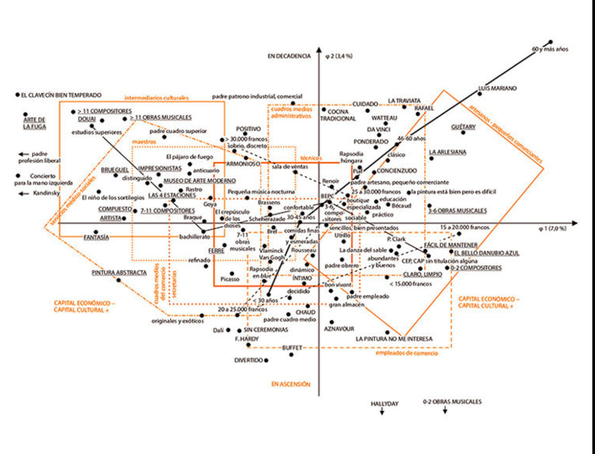

```{r setup, include=FALSE}
knitr::opts_chunk$set(echo = TRUE)
```

```{r message=FALSE, warning=FALSE, include=FALSE, paged.print=FALSE}
knitr::opts_chunk$set(echo=TRUE, message=FALSE, warning=FALSE, collapse=TRUE, highlight=TRUE, paged.print=FALSE, prompt=TRUE, strip.white=FALSE, tidy = TRUE)
```


```{r message=FALSE, warning=FALSE, include=FALSE, paged.print=FALSE}

knitr::opts_chunk$set(echo=TRUE, message=FALSE, warning=FALSE, collapse=TRUE, highlight=TRUE, paged.print=FALSE, prompt=TRUE, strip.white=FALSE, tidy = TRUE)

```

```{r}
library(patchwork)
library(tidyverse)
library(tidymodels)
library(GDAtools)
```


## Análisis de Correspondencias Múltiples (variables cualitativas)

La clase pasada habíamos trabajado sobre PCA que operaba sobre variables cuantitativas. Ahora, ¿qué pasa si tenemos variables cualitativas? Si bien no podemos usar PCA, sí podemos echar mano a otras técnicas más adecuadas y con una lógica bastante similar. 

Seguramente, la aplicación más famosa de la técnica que vamos a trabajar sea el siguiente gráfico:



El famoso mapa de los espacios y capitales sociales que Bourdieu despliega en "La Distinción". Luego podemos discutir sobre si el gráfico es claro o no, pero lo que nos interesa destacar aquí es que el mismo fue construido con el llamado Análisis de Correspondencias Múltiples (o MCA por sus sigrlas en inglés)

## Una primera formalización
Tenemos, ahora, una matriz de datos con variables cualitivas. Si recordamos lo que trabajamos el cuatrimestre anterior, podemos retomar la idea de que es posible representar una variable cualitativa en una matriz, como un conjunto de columnas "dummy": tomábamos una categoría base y podíamos representar la variable como k-1 columnas (k es la cantidad de categorías) dicotómicas.

Por ejemplo, esta variable

```{r}
ex <- tibble(id = 1:7,
       confianza = as.factor(c("Media","Alta", "Baja","Media", "Baja", "Baja", "Alta")),
       voto = as.factor(c("Sí", "No", "Sí", "Sí", "Sí", "No", "Sí")),
       niv_educ = as.factor(c("Prim.", "Sec.",  "Sec.", "Terc. o univ.", "Prim.",  "Sec.", "Terc. o univ.")),
       )
```

podemos representarla como

```{r}
ex_dum <- ex %>% 
  recipe(~ .) %>% 
  step_dummy(confianza, voto, niv_educ) %>% 
  prep(training = ex) %>% 
  bake(new_data=ex)

ex_dum
```

---

**Actividad**
¿Qué pasó en el código anterior?


---

Se observa, por ejemplo, que la categoría base que se tomó fue "Alta". Así, el perfil `confianza_Baja == 0 & confianza_Media == 0` que el registro 5 tiene confianza "Alta".

Pero supongamos que queremos retener todos los niveles, es decir, no tomar ninguna categoría como base:

```{r}
ex_dummy2 <- ex %>% 
  recipe(~ .) %>% 
  step_dummy(confianza, voto, niv_educ, one_hot = TRUE) %>% 
  prep(training = ex) %>% 
  bake(new_data=ex)


ex_dummy2
```

Vamos a llamar a esta tabla "tabla disyuntinva completa" y va a ser uno de los insumos fundamentales del MCA. En general, vamos a ver que a esta tabla se la suele llamar $\textbf{Z}$. Siendo la matriz $\textbf{Z}$ una matriz de ceros y unos, se debe tomar en cuenta este hecho para deducir la forma particular que tienen las nubes de puntos sobre las que se hará el
análisis.

Tenemos, entonces, $n$ individuos y $q$ variables. Los marginales de $\textbf{Z}$ son 

- $z_{i.} = q$ porque hay $q$ unos en cada fila
- $z_{.j} = q$ número de individuos con la característica $j$

Así, la suma total de la tabla es 

$$\sum_{i}\sum_{j} z_{ij}= nq$$

A partir $\textbf{Z}$ vamos a construir la llamada "Tabla de Burt" $\textbf{B}$ de la siguiente forma:

$$\textbf{B} = \textbf{Z}^T \textbf{Z}$$

Más simple: $\textbf{B}$, que contiene por bloques las tablas de contingencia de cada pareja de variables cualitativas. Por ejemplo, para el caso de las tablas anteriores, entonces la tabla de Burt puede tener el aspecto

```{r}
as_tibble(burt(data.frame(ex %>% select(-id))),rownames="var")
```

Si llamamos $D = diag(z_{.j})$ a la diagonal de los márgenes columna de $\textbf{Z}$, entonces, hacer MCA es diagonalizar la matriz $\textbf{Z}$ o la matriz $\textbf{B}$


$$ \textbf{S} =     \frac{1}{q} \textbf{Z}^T \textbf{Z} \textbf{D}^{-1} = \frac{1}{q}  \textbf{B} \textbf{D}{^-1}$$

## Un caso real...
Basta de abstracciones. Vamos a trabajar con el siguiente problema: queremos a partir de la Encuesta Permanente de Hogares del III trimestre de 2022 poder construir índices que nos hablen de las condiciones contractuales y laborales en que se desarrolla el trabajo de los asalariados ocupados en la semana de referencia.

Si revisamos la documentación y el [diseño de registro](https://www.indec.gob.ar/ftp/cuadros/menusuperior/eph/EPH_registro_3T2021.pdf)] vemos que hay muchas variables que podrían servir para tal objetivo. En particular, vamos a ver las siguientes:


Así, podemos ver que hay cierta estructura en las variables:

-   un primer set de variables se relacionan con diferentes pagos o beneficios "en especie": comida (`PP07F1`); uso gratuito de vivienda (`PP07F2`); pago en productos (`PP07F3`) y otros (`PP07F4`)
-   otras, se vinculan a ciertos beneficios laborales formales: vacaciones (`PP07G1`), aguinaldo (`PP07G2`), días por enfermedad (`PP07G3`), obra social (`PP07G4`), descuentos jubilatorios y/o aportes realizados de forma autónoma por le trabajador (un monotributista del Estado sería una situación típica) (`PP07H`, `PP07I`)
-   finalmente, podemos encontrar el turno de trabajo (`PP07J`) y la percepción de un recibo de sueldo (`PP07K`)

De esta forma, la idea va a ser combinar estas variables en por lo menos un índice que nos permita resumir dicha información.


### Construyendo un índice de condiciones de trabajo (ICT)

Ahora sí, vamos a los datos. En primer lugar, cargamos los paquetes. Además de `tidyverse` vamos a usar los siguientes:

-   `eph`: para la carga y etiquetado de los datos de la EPH
-   `FactoMineR`: para la estimación del modelo de MCA
-   `factoextra`: para algunas visualizaciones
-   `ggrepel`: para mejorar las visualizaciones

```{r}
library(tidyverse)
library(eph)
library(FactoMineR)
library(factoextra)
library(ggrepel)
```

#### Procesamiento de los datos

En primer lugar, cargamos los datos y los etiquetamos:

```{r message=FALSE}
df <- get_microdata(year=2021, trimester = 3) %>%
      organize_labels() %>%
      organize_caes() %>%
      organize_cno()
```

Luego, vamos a realizar algunas operaciones de preprocesamiento importantes. Transformamos dos variables a formato `character`.

```{r}
df <- df %>%
        mutate(ESTADO = as.character(ESTADO),
               CAT_OCUP = as.character(CAT_OCUP),
               PONDERA = as.numeric(PONDERA))
```

Luego, recodificamos las variables que vamos a usar y las dicotomizamos. Además, las renombramos para poder interpretarlas mejor.

```{r}
df <- df %>%
        mutate(across(PP07F1:PP07I, ~as.factor(if_else(.==2 , 'No percibe', 'Percibe')))) %>%
        mutate(across(PP07J:PP07K,  ~as.factor(if_else(.==1 , 'Si', 'No')))) %>%
        rename( PP07F1_comida= PP07F1,
                PP07F2_vivienda = PP07F2,
                PP07F3_producto = PP07F3,
                PP07F4_otro_especie = PP07F4,
                PP07G1_vacaciones = PP07G1,
                PP07G2_aguinaldo = PP07G2,
                PP07G3_dias_enf = PP07G3,
                PP07G4_obra_social = PP07G4,
                PP07H_descuento_jub = PP07H,
                PP07I_aporta_si = PP07I,
                PP07J_turno_diurno = PP07J,
                PP07K_recibo = PP07K)
```

Filtramos a las personas ocupadas y a las personas asalariadas:

```{r}
df <- df %>% filter(ESTADO == 'Ocupado' & CAT_OCUP == "Obrero o empleado")
```

Luego, pasamos a esitmar el modelo. En las primeras líneas seleccionamos las 13 variables que vamos a trabajar (`PP07F1_comida:PP07K_recibo`) y eliminamos las que solo codifican las no respuestas en ninguna (`PP07F5` `PP07G_59`). Ese dataset de 13 columnas será el input para la función `MCA()`. La misma tiene cuatro argumentos importantes (aunque tiene varios otros que pueden chequear en la documentación):

-   `X`: los datos de input
-   `ncp`: la cantidad de componentes a preservar en el resultado (en este caso, 2)
-   `row.w`: un vector de pesos de las observaciones
-   `graph`: un booleano que es `FALSE` si no queremos que se despliegue otro gráfico

Vamos a estimar, entonces, un MCA con las 13 columnas mencionadas, sobre los 14831 registros de asalariados ocupados, nos vamos a quedar con 2 componentes y vamos a pasarle la variable `PONDERA` como vector de pesos.

```{r}
mca_ict <- df %>% 
        select(PP07F1_comida:PP07K_recibo, -PP07F5, -PP07G_59) %>%
        MCA(X = .,
          ncp = 2,
           row.w = df$PONDERA,
          graph=FALSE
        )
```

Hemos guardado en el objeto `mca_ict` los resultados. Vamos a explorarlos un poco. Se trata de una lista con varios elementos. Lo primero que podemos ver son los autovalores y la varianza explicada.

```{r}
mca_ict$eig
```

Podemos ver un restulado gráfico de la siguiente forma:

```{r}
fviz_eig(mca_ict)
```

Se observa que tenemos una dimensión (la primera) que explica más de un 50% de la varianza y la segunda un 15%. Por lo cual, manteniendo solamente los dos primeros componentes estaríamos reteniendo un 68% de la variabilidad contenida.

Pero, además, es importante poder interpretar los resultados. Para ello vamos a genear un gráfico de las categorías de cada variable.

```{r}
mca_ict$var$coord %>%
  as_tibble(rownames = 'var') %>%
  ggplot(aes(x=`Dim 1`, y=`Dim 2`)) + 
    geom_point() +
    geom_text_repel(aes(label=var), max.overlaps = 20, size=3) +
    ylim(-3,6) +
    theme_minimal()
```

Obtendríamos un resultados similar utilizando la función `fviz_mca_ind()`. Si intentamos analizar qué expresa cada uno de los ejes, podemos ver que a la izquierda del eje X () tenemos respuestas positivas en derechos laborales (vacaciones, aguinaldo, días por enfermedad, tenencia de aportes jubilatorios, ya sean realzados por el empleador o realizados por el asalariado mismo). A la derecha, en cambio, se observa la ausencia de estos conceptos. De esta forma, podemos interpretar que el eje X es algo así como un índice de percepción de derechos laborales: valores negativos implican mayor percepción de derechos. Lógicamente, este esquema es algo confuso, quisiéramos un índice que tenga valores altos cuando la percepción de derechos es alta. Para resolver esto, simplemente, multiplicamos los valores de la `Dim 1` por -1.

```{r}
mca_ict$var$coord %>%
  as_tibble(rownames = 'var') %>%
  ggplot(aes(x=`Dim 1`*-1, y=`Dim 2`)) + 
    geom_point() +
    geom_text_repel(aes(label=var), max.overlaps = 20, size=3) +
    ylim(-3,6) +
    labs(x="Dim 1",
         y="Dim 2") +
    theme_minimal()
```

A su vez, el eje Y muestra la percepción de algunos beneficios que podríamos llamar informales/en especie: valores altos en el eje Y muestran respuestas positivas en beneficios en especie (casa, comida, etc.). Podríamos interpretar esto diciendo que la percepción de varios de esos beneficios (casa, comida, etc.) es independiente de la percepción de otros derechos.

Un punto importate es entender cuál es la "importancia" de las diferentes variables en cada dimensión. Una primera intuició podemos obtenerla a partir de ver la cercanía de cada etiqueta sobre cada eje. Cuanto más cerca esté cada etiqueta de cada eje, más importnate será la variable, más correlacionada estará con esa dimensión.

---

**Actividad**
Nombrar las dos variables más importantes de la dimensión 1 a partir del gráfico anterior.

---

Pero podemos utilizar otra función para generar un gráfico `fviz_contrib()`. Le pedimos que use el objeto `mca_ict` que contiene nuestras estimaciones, que calcule la contribución de cada variable de la dimensión 1.

```{r}
fviz_contrib(mca_ict, 'var', axes=1)
```

Podemos ver, entonces que las variables más importantes son: - obra social - aguinaldo - días por enfermedad - descuento jubilatorio

es decir, aquellas variables vinculadas a derechos formales.


|**Actividad** 
|¿Cuáles son las variables más relevantes de la Dimensión 2?

### Análisis de la dimensión 1
Como dijimos más arriba, podemos pensar a la dimensión 1 como un indicador que expresa una variable "latente": el nivel de condiciones de trabajo, particularmente de aquellos beneficios de carácter más formal.

Tenemos, entonces, una variable cuantitativa que expresa la co-ocurrencia de respuestas positivas (o negativas) vinculadas a beneficios laborales formales. Podemos, entonces, calcular el valor de cada individuo en ese indicador: extraemos del objeto `mca_ict` las coordenadas individuales `mca_ict$ind$coord`, los transformamos en una tibble y los agregamos como columnas al dataset original.
```{r}
df <- df %>%
  bind_cols(
            mca_ict$ind$coord %>%
              as_tibble() %>%
              rename(
                dim_1 =`Dim 1`,
                dim_2 =`Dim 2`)
  )
```

Luego, lo multiplicamos por -1 para que quede en la escala correcta:
```{r}
df <- df %>%
  mutate(dim_1 = dim_1 * -1)
```

Entonces, podemos trabajar este índice como una variable cuantitativa cualquiera. Podemos calcular diferentes métricas, generar gráficos, etc. A título de ejemplo, podemos pensar en analizar las diferencias entre los diferentes grados de formalidad del trabajo entre diferentes calificaciones. Vamos a calcular la media (ponderada por la varibale de pesos que la EPH usa):

```{r}
df %>%
  mutate(CALIFICACION = factor(case_when(
    CALIFICACION %in% c('falta informacion', 'Ns.Nc', 'otro') ~ 'Ns/Nc',
    TRUE ~ CALIFICACION
  ), levels=c("Profesionales", "Técnicos", "Operativos", "No calificados", "Ns/Nc") )) %>%
  group_by((CALIFICACION)) %>%
  summarise(mean=weighted.mean(dim_1, PONDERA),
            w_median = Hmisc::wtd.quantile(dim_1, PONDERA, probs=0.5),
            median = median(dim_1),
            n=sum(PONDERA),
            nn = n())
```
Se observa cómo a mayor calificación las ocupaciones de mayor calificaión aparecen más asociadas a mejores condiciones de contratación.

