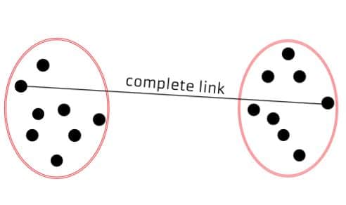
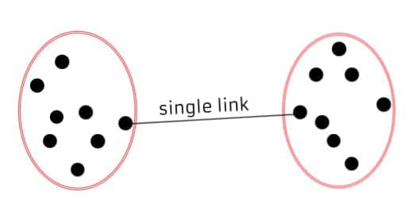
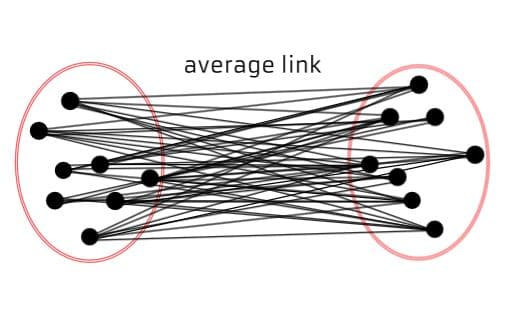
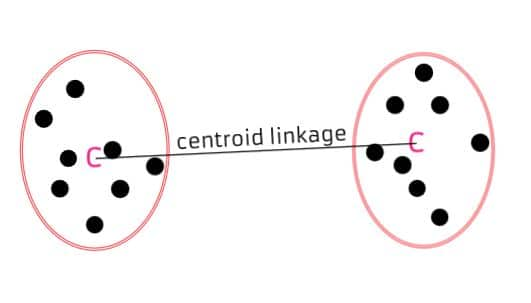

```{r setup, include=FALSE}
knitr::opts_chunk$set(echo = TRUE)
```

```{r message=FALSE, warning=FALSE, include=FALSE, paged.print=FALSE}
knitr::opts_chunk$set(echo=TRUE, message=FALSE, warning=FALSE, collapse=TRUE, highlight=TRUE, paged.print=FALSE, prompt=TRUE, strip.white=FALSE, tidy = TRUE)
```

```{r message=FALSE, warning=FALSE, include=FALSE, paged.print=FALSE}

knitr::opts_chunk$set(echo=TRUE, message=FALSE, warning=FALSE, collapse=TRUE, highlight=TRUE, paged.print=FALSE, prompt=TRUE, strip.white=FALSE, tidy = TRUE)

```

```{r}
library(patchwork)
library(tidyverse)
library(tidymodels)
library(GDAtools)
library(ggdendro)
```

## Bibliografía de esta clase
- James, G.; Witten, D.; Hastie, T. y Tibshirani, R. (2021). _An Introduction to Statistical Learning_, Berlin: Springer. Cap. 12.1, 12.2, 12.4. [Descarga del libro completo](https://hastie.su.domains/ISLR2/ISLRv2_website.pdf).
- Donaire, R.; Rosati, G. y Mattera, P. (2021). "Pobreza y desarrollo capitalista en el mundo, 2005-2015" en XV Congreso ASET. [Descarga artículo](https://aset.org.ar/wp-content/uploads/2022/08/4_DONAIRE_ponencia.pdf).

## Introducción
En esta notebook vamos a explorar el segundo de los métodos de clusterización vistos en la clase teórica. Los métodos de clusterización que veremos corresponden al rama de ML de aprendizaje no supervisado. Recordemos: la idea principal es encontrar grupos en los datos que sean similares a otros datos del mismo grupo y lo menos similar posible a datos en otros.

Hoy vamos a trabajar con clustering jerárquico. Sobre el mismo dataset de la semana pasada: un dataset (`.wb_bank_data_2019.csv`) con información construida por el Banco Mundial acerca de la distribución de la población ocupada según grandes sectores de actividad y categoría ocupacional:

- `SL.AGR.EMPL.ZS`: % total el empleo en agricultura: consistente en las actividades de agricultura, silvicultura, caza y pesca  
- `SL.IND.EMPL.ZS`: % total de empleo en industria:  en actividades de minas y canteras, manufacturas, construcción y energía, gas y agua.
- `SL.SERV.EMPL.ZS` % total de empleo el servicios comprende comercio al por mayor y menor y restaurantes y hoteles, transporte, almacenamiento y comunicaciones, finanzas, seguros, servicios inmobiliarios y a las empresas y servicios personales, sociales y comunales.
- `SL.FAM.WORK.ZS`: % total de trabajadores familiares
- `SL.EMP.MPYR.ZS`: % total de empleadores  
- `SL.EMP.SELF.ZS`: % total de independientes (suma de empleadores y cuenta propia y familiares)
- `SL.EMP.WORK.ZS`: % total de trabajadores asalariados

El problema va a ser el mismo: construir una tipología de países en función de su estructura ocupacional. La idea va a ser poder agrupar países que tengan perfiles parecidos en la distribución de la población según rama y según cateogría ocupacional.

## Algunos fundamentos de este método

A diferencia el método que vimos la semana pasada, HC es aglomerativo. Va sumando y agregando clusters en cada iteración. Esto proporciona, como mencionamos, un método para seleccionar el parámetro $k$ (cantidad de clústers) de forma directa. 

¿Cómo funciona?

1. Comienza con $n$ observaciones y una medida (como la distancia euclidiana) de todos los ${n \choose 2} = \frac{n(n-1)}{2}$  disimilitudes por pares. Considera a cada uno observación como su propio grupo.

2. Para $i = n, n − 1,..., 2$:

    2.1 Examina todas las diferencias entre grupos por pares entre los $i$ grupos e identificar el par de grupos que son menos diferentes (es decir, lo más parecido). Fusiona estos dos grupos. La disimilitud entre estos dos grupos indica la altura en el dendrograma a la que se debe colocar la fusión.

    2.2 Calcule las nuevas disimilitudes entre conglomerados por pares entre los $i − 1$ grupos restantes. 
    
Hay varias formas de medir la distancia entre los conglomerados para decidir las reglas de conglomerado y, a menudo, se denominan Métodos de vinculación. Algunos de los métodos de vinculación comunes son:

- Complete: Máxima disimilitud entre cúmulos. Calcula todas las diferencias por pares entre las observaciones en el conglomerado A y el observaciones en el conglomerado B, y registra el mayor de estos disimilitudes.



- Single: Disimilitud mínima entre clústeres. Calcule todas las diferencias por pares entre las observaciones en el conglomerado A y el observaciones en el conglomerado B, y registre la más pequeña de estas disimilitudes. El enlace único puede dar como resultado un arrastre extendido grupos en los que las observaciones individuales se fusionan una a la vez.


-Average: Disimilitud media entre grupos. Calcula todas las diferencias por pares entre las observaciones en el conglomerado A y el observaciones en el conglomerado B y registra el promedio de estas disimilitudes.


- Centroid: Disimilitud entre el centroide del conglomerado A (una media vector de longitud p) y el centroide para el grupo B. Puede resultar en inversiones indeseables.


- Ward: Se basa en minimizar la suma total de cuadrados dentro del grupo de la fusión de dos grupos. Este método fusiona dos grupos de manera que la fusión da como resultado la suma de cuadrados más pequeña.

Una cuestión importante es la elección de una métrica de distancia a utilizar. Hasta ahora, los ejemplos de este capítulo han utilizado la distancia euclidiana como medida de disimilitud. Pero a veces otras medidas de disimilitud pueden ser preferido: distancias de Minkowski, Manhattan, etc. [Acá pueden encontrar](https://aiaspirant.com/distance-similarity-measures-in-machine-learning/) un pequeño catálogo.

Por ejemplo, distancias basadas en métricas de correlación consideran que dos observaciones son similares si sus características están altamente correlacionadas, aunque la los valores observados pueden estar muy separados en términos de distancia euclidiana. Esto es un uso inusual de la correlación, que normalmente se calcula entre variables; aquí se calcula entre los perfiles de observación para cada par de observaciones. La distancia basada en la correlación se centra en la formas de los perfiles de observación en lugar de sus magnitudes.

La elección de la medida de disimilitud es muy importante, ya que tiene un fuerte efecto sobre el dendrograma resultante. En general, se debe prestar especial atención pagado al tipo de datos que se agrupan y la pregunta científica en cuestión. Estas consideraciones deberían determinar qué tipo de medida de disimilitud se utiliza para la agrupación jerárquica.


## Preprocesamiento
Vamos a cargar los datos y a preprocesarlos de la misma forma que la semana pasada. Los detalles pueden buscarlos en la clase anterior.
```{r}
df <- read_csv('./data/wb_bank_data_2019.csv')

df <- df %>%
     pivot_wider(id_cols = c(iso3c, iso2c, country), names_from = indicatorID, values_from = value)

df <- df %>%
  mutate(prop_tcp = SL.EMP.SELF.ZS - SL.FAM.WORK.ZS - SL.EMP.MPYR.ZS) %>%
  rename(prop_emp = SL.EMP.MPYR.ZS,
         prop_familiar = SL.FAM.WORK.ZS,
         prop_asal = SL.EMP.WORK.ZS)

df <- df %>%
  mutate(prop_pob_rel_sal = prop_asal + prop_emp ,
         prop_pob_rel_no_sal = prop_familiar + prop_tcp)

```

## Entrenando un modelo de clustering jerárquico 
Vamos a usar 3 variables para construir nuestro clustering:
- % de población inserta en relaciones salariales
- % de población ocupada en agricultura
- % de población ocupada en servicios

Antes de esto, vamos a normalizar las variables usando `recipes`.
Podemos realizar HC aglomerativo con `hclust`. 

```{r}
recipe_km <-df %>% 
            recipe(~.) %>%
            step_normalize(c(prop_pob_rel_sal, SL.AGR.EMPL.ZS, SL.SRV.EMPL.ZS)) 

set.seed(123)
dist <- recipe_km %>%
            prep() %>%
            bake(df) %>%
            select(prop_pob_rel_sal, SL.AGR.EMPL.ZS, SL.SRV.EMPL.ZS) %>%
            dist(.x, method="euclidean")

hc_clust <- hclust(dist, method="ward.D2")
```

¿Qué pasó acá?

Primero, generamos una receta que va a normaalizar las tres variables a utilizar en el clustering.

Luego, calculamos los valores de disimilitud con `dist`.

Finalmente,  ingresamos estos valores en hclust y especificamos el método de aglomeración que se usará (es decir, `"complete"`, `"average"`, `"single"`, `"ward.D"`). 

Ahora podemos dibujar el dendrograma. Podemos usar la función `plot

```{r}
plot(hc_clust)
```

Pero podemos trabajarlo con `ggplot`:

```{r}
dhc <- as.dendrogram(hc_clust)

data <- dendro_data(dhc, type = "rectangle")

ggplot(segment(data)) + 
  geom_segment(aes(x = x, y = y, xend = xend, yend = yend)) + 
  geom_hline(yintercept=6, color="red") +
  coord_flip() + 
  scale_y_reverse(expand = c(0.2, 0)) +
  theme_minimal()

```

Como puede verse, parece evidente que hay al menos cuatro/cinco clusters. Podemos, entonces, extraer las etiquetas de cada cluster y agregarlas a la tabla de datos:

```{r}
df <- df %>%
  mutate(hc_clust = as.factor(cutree(hc_clust, k = 5)))
```


**Grafico 1. % de población inserta en relación salariales (eje x) según % de población inserta en servicios por pertenencia a cada clúster**
```{r}
df %>%
  ggplot(aes(x=prop_pob_rel_sal, y=SL.AGR.EMPL.ZS, color=hc_clust)) +
    geom_point() +
    xlim(0,100) +
    ylim(0,100) +
    labs(x="% pob. rel. sal.",
         y="% pop. agr. ",
         color="Cluster") + 
    theme_minimal()
```

### Caracterizando los clusters
Como vimos más arriba, pegamos la pertenencia de cada país a cada cluster en la tabla original. Podemos repetir el esquema de análisis de la clase pasada. A partir de allí podemos pasar a tratar de interpretar qué nos dice cada clúster. Generemos un boxplot de la distirbución de cada variable para cada clúster. Para eso vamos a llevar las tres variables con las que generamos el cluster y la variable de pertenencia al cluster a un formato long. 

**Gráfico 8. Boxplot de variables vinculadas a la división del trabajo y a la cateogría ocupacional según cluster (k=5)**
```{r}
df %>%
  select(country, hc_clust, SL.AGR.EMPL.ZS:SL.SRV.EMPL.ZS, prop_pob_rel_sal) %>%
  pivot_longer(cols = SL.AGR.EMPL.ZS:prop_pob_rel_sal) %>%
  ggplot(aes(y=value, fill=hc_clust)) + 
    geom_boxplot() +
    theme_minimal() +
        theme(axis.title.x=element_blank(),
        axis.text.x=element_blank(),
        axis.ticks.x=element_blank()) +
    facet_wrap(~name)
```
Vemos que los resultados son similares a los de K-medias:

- un cluster (cluster 3) con mayor desarrollo de relaciones salariales y peso de los servicios y menor peso del campo.
- otro, (cluster 5) con las características opuestas
- un gradiente de situaciones intermedias.

Pero mucho más interesante sería generar un mapa:

```{r fig.height=8, fig.width=12}
worldmap <- map_data("world")
worldmap$iso3c <- maps::iso.alpha(x=worldmap$region,n=3)

worldmap <- worldmap %>%
    left_join(df %>% select(country, iso3c, hc_clust))

worldmap %>%
  drop_na(hc_clust) %>%
    ggplot() + 
    geom_polygon(aes(x=long, y=lat, group=group, fill=as.factor(hc_clust)), color='black') +
  labs(fill='') +
    theme_minimal() +
    theme(legend.position='bottom',
          legend.text = element_text(size=23))

```

